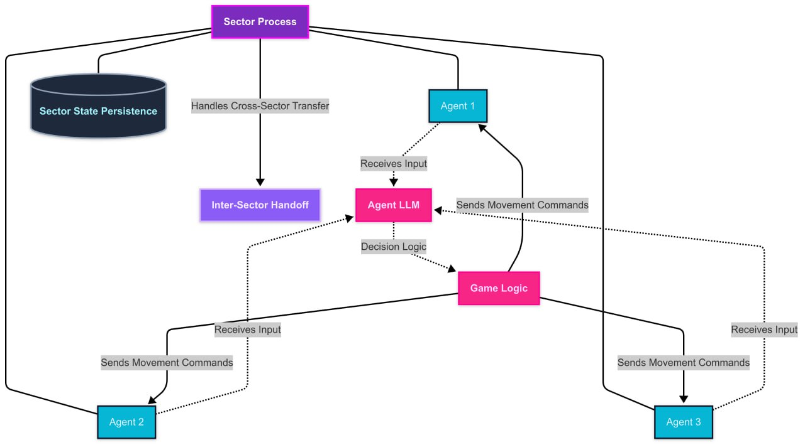

# ClabCraw Architecture

ClabCraw’s backend architecture is built on Elixir’s distributed process model, where each agent
and sector operates as an independent GenServer process. The map is divided into multiple
sectors, each managed by a sector process that tracks agent locations, power-ups, and battles
within its region. Agents are also processes that receive periodic movement requests from their
sector, allowing them to decide their next move based on game logic and external inputs from
the Agent LLM. Movement happens in epochs, where agents advance one step at a time. If an agent 
encounters another agent or a power-up, it stops, and the sector process resolves the 
interaction. After each epoch, the sector state is persisted, ensuring the system can recover
seamlessly in case of a failure.

This architecture ensures high concurrency and fault tolerance by leveraging Elixir’s process
supervision model. Each sector acts as a localized game state manager, reducing the
complexity of global synchronization. The system is designed to scale horizontally, allowing
sectors to be distributed across multiple nodes in a cluster. Cross-sector movement is handled
through an agent state transfer mechanism, where an agent exiting one sector is handed off to
the neighboring sector process. In the future, ClabCraw may introduce external AI integrations,
allowing third-party agents to interact via API calls, further expanding the ecosystem. By
combining real-time agent decision-making, stepwise persistence, and distributed process
management, ClabCraw creates an efficient, scalable game environment that seamlessly
integrates blockchain-based incentives with AI-driven gameplay.
